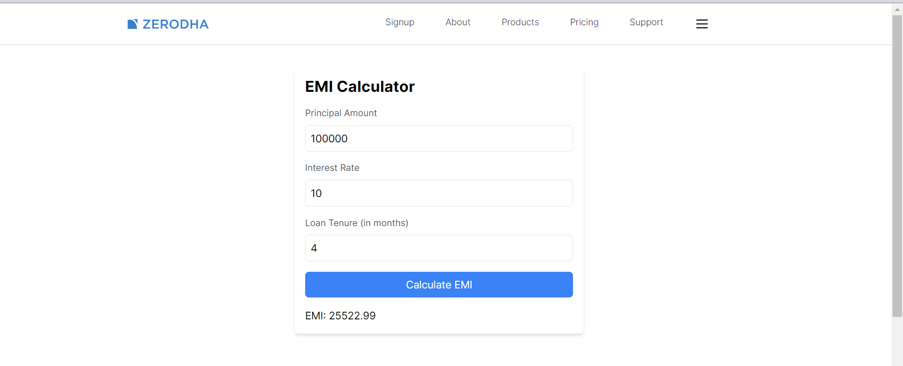

## Build a EMI Calculator using Next.js

The Loan Calculator allows users to determine loan amount, interest rate, and tenure, calculate monthly mortgage payments, total loan payments over tenure, and total interest payable. In this article, we will walk you through the process of building a Loan Calculator using Next.js.

# Technologies Used/Prerequisites
- Introduction to Next
- Next Component
- React
- NPM or NPX

# Feature
- Simple Emi calcualtor

First, run the development server run below commands:

```bash
npm install

npm run dev

```

Open [http://localhost:3000](http://localhost:3000) with your browser to see the result.

